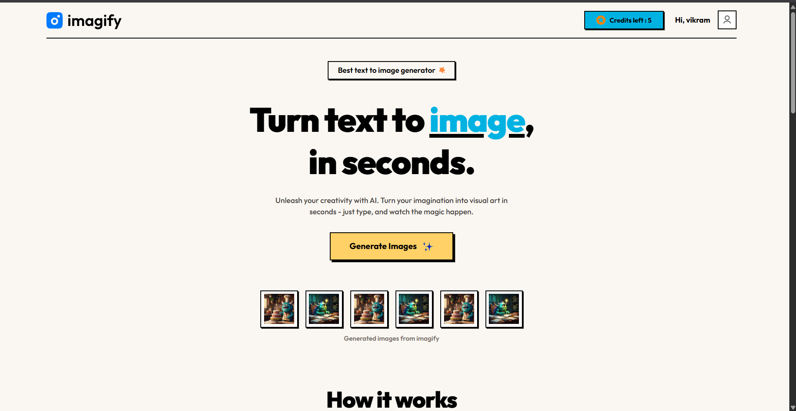
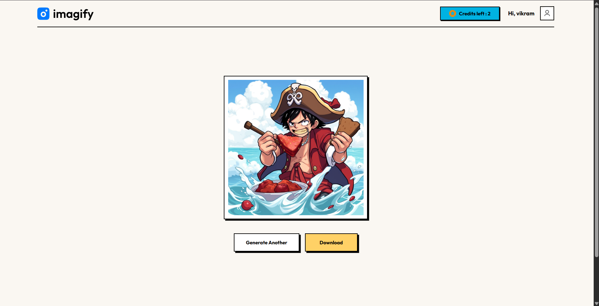
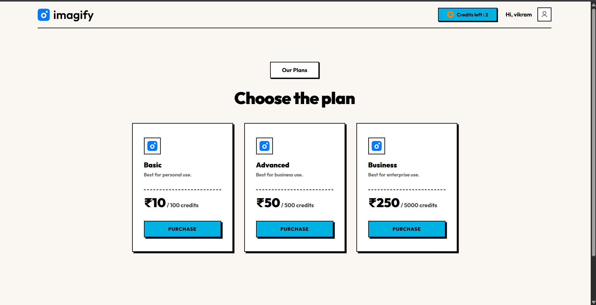
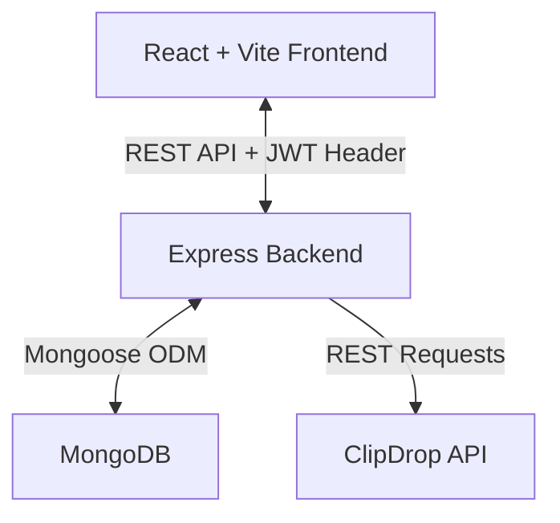

# 🎨 Imagify — AI Image Generator

An AI-powered full-stack SaaS platform that **converts natural language text prompts into high-quality visual art** in seconds using the ClipDrop API. The platform features JWT user authentication, credit balances, payment plan selection, and an energy-efficient Sustainable Web Design system.

---

## 📸 Screenshots

### 🏠 Home Page

<p align="center">
  
</p>

### 🔍 Generation Workspace

<p align="center">
  
</p>

### 💳 Pricing & Credits

<p align="center">
  
</p>

---

## ✨ Features

| Feature | Description |
|---|---|
| **🎨 AI Image Generation** | Converts user text prompts into base64 images via integration with the ClipDrop API |
| **🔑 Secure JWT Auth** | Password encryption using Bcrypt and token-based validation middleware for private endpoints |
| **💳 Credit Management** | Implements a consumption gate (deducts 1 credit per generation; locks generation when at 0) |
| **⚡ Sustainable Design System**| Custom Neo-Brutalist look featuring a warm cream palette (`#FAF7F2`), thick borders, and flat shadows |
| **📦 Persistent DB Storage** | Stores registered user credentials and tracks credit account balances in MongoDB via Mongoose |

---

## 🏗️ Architecture



### How It Works

1. **User Sign-up & Login** — Users sign up or authenticate. The backend hashes credentials via Bcrypt and issues a JWT token.
2. **Authorized Prompt Submission** — The user types a text prompt in the Result workspace. The React client forwards the payload with the JWT token header to `POST /api/image/generate-image`.
3. **Credit Verification** — The auth middleware decodes the token, and the image controller checks the user's Mongoose model in MongoDB to ensure the `creditBalance > 0`.
4. **ClipDrop Processing** — The backend builds a multi-part form data request with the user's prompt and forwards it to the ClipDrop text-to-image API.
5. **Base64 Delivery & DB Decrement** — The binary image response is transformed into a base64 Data URI on the server. The server decrements the user's credit balance in MongoDB by 1 and returns the base64 URI for immediate rendering.

---

## 🛠️ Tech Stack

### Frontend
- **React 19** + **Vite 7** (SPA setup)
- **Vanilla CSS** + **Tailwind CSS v4** styling (Neo-brutalist flat UI variables)
- **Axios** for REST API integration
- **React Router DOM v7** for frontend routes
- **React Toastify** for notification alerts

### Backend
- **Node.js** + **Express.js** (ES module standard)
- **Mongoose ODM** for data modeling
- **MongoDB** cloud/local database
- **Bcrypt** for hashing user passwords
- **jsonwebtoken (JWT)** for signing session tokens
- **Axios** + **Form-Data** for ClipDrop external calls

---

## 🚀 Getting Started

### Prerequisites

- **Node.js 18+** and **npm**
- A **MongoDB** connection string (Local Instance or MongoDB Atlas Cloud)
- A **ClipDrop API Key** ([clipdrop.co/apis](https://clipdrop.co/apis))

### 1. Clone the Repository

```bash
git clone https://github.com/<your-username>/imagify.git
cd imagify
```

### 2. Backend Setup

```bash
cd server

# Install backend packages
npm install
```

Create a `.env` file in the `server/` directory:

```env
MONGODB_URI=mongodb+srv://<user>:<password>@cluster.mongodb.net
JWT_SECRET=your_jwt_signing_key_here
CLIPDROP_API=your_clipdrop_api_key_here
PORT=4000
```

Start the Express development server:

```bash
npm run server
```

The server will open at `http://localhost:4000`.

### 3. Frontend Setup

```bash
cd ../client

# Install frontend dependencies
npm install

# Start the Vite local server
npm run dev
```

The application client will open at `http://localhost:5173`.

---

## 📁 Project Structure

```
text_to_image/
├── client/
│   ├── src/
│   │   ├── App.jsx            # Routing configurations & base layout
│   │   ├── index.css          # Custom Neo-brutalist theme variables
│   │   ├── pages/             # Pages (Home, Result, BuyCredit)
│   │   ├── components/        # Components (Navbar, Header, Steps, Description, Textimonials, GenerateBtn, Login, Footer)
│   │   ├── context/           # AppContext state & API functions wrapper
│   │   └── assets/            # Vector icons, profile photos, and sample images
│   ├── package.json
│   └── vite.config.js
├── server/
│   ├── config/
│   │   └── mongodb.js         # Mongoose connection initialization
│   ├── controllers/
│   │   ├── imageController.js # ClipDrop API generation endpoint logic
│   │   └── userController.js  # JWT Login, Register, & Credit balance check
│   ├── middlewares/
│   │   └── auth.js            # JWT header validation middleware
│   ├── models/
│   │   └── userModel.js       # User Mongoose Schema definition
│   ├── routes/
│   │   ├── imageRoutes.js     # Image generation router endpoints
│   │   └── userRoutes.js      # Authentication router endpoints
│   ├── server.js              # Express app core entrypoint
│   └── package.json
├── PROJECT_ONE_FILE.md        # Technical explanation document
├── verification_report.md     # Capability verification audit
├── .gitignore                 # Root repository exclusions file
└── README.md                  # Project documentation (this file)
```

---

## 🔐 Environment Variables

| Variable | Description | Required |
|---|---|---|
| `MONGODB_URI` | MongoDB connection URL string | Yes |
| `JWT_SECRET` | Secret token key for signing user sessions | Yes |
| `CLIPDROP_API` | ClipDrop Developer API Key | Yes |
| `PORT` | Local Express Server port (defaults to 4000) | No |
#
